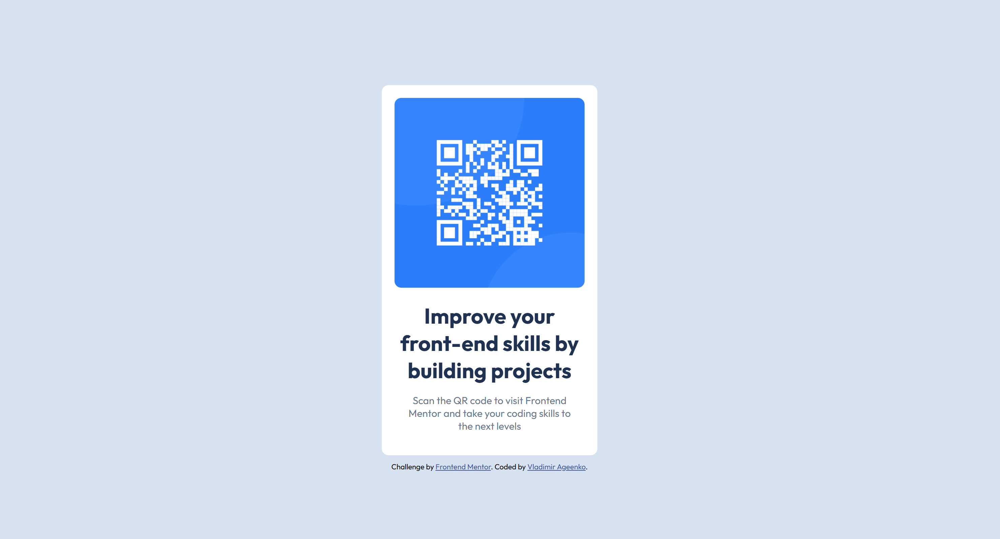

# Frontend Mentor - QR code component solution

This is a solution to the [QR code component challenge on Frontend Mentor](https://www.frontendmentor.io/challenges/qr-code-component-iux_sIO_H).

## Overview

### The challenge
The goal was to build a responsive QR code component as close to the original design as possible.

### Screenshot
 

## My process

### Built with
- Semantic HTML5 markup
- CSS3 (Custom properties(Variables) & Flexbox)
- **BEM Methodology** (Block Element Modifier)
- Mobile-first workflow

### What I learned
In this project, I practiced structured naming conventions using BEM and learned how to manage styles efficiently with CSS variables. I also improved my skills in creating responsive layouts that work on both mobile and desktop screens.

## Author
- Frontend Mentor - [@voldy831](https://www.frontendmentor.io/profile/voldy831)
- GitHub - [voldy831](https://github.com/voldy831)